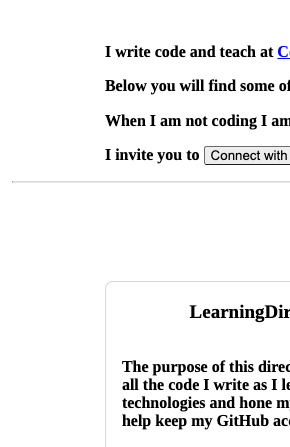
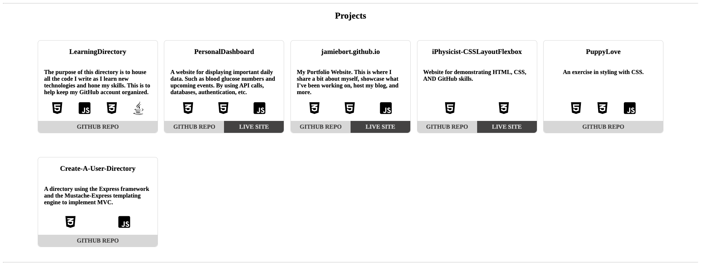
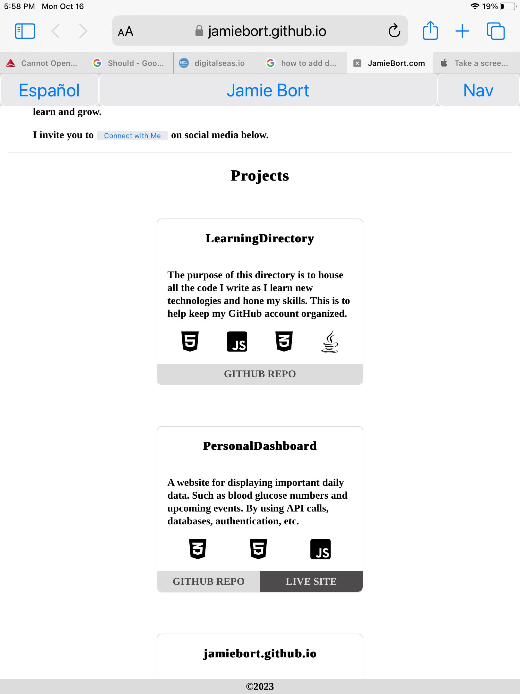
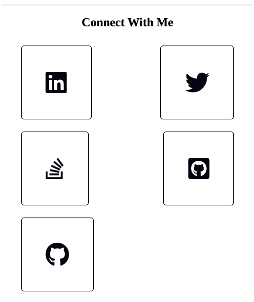
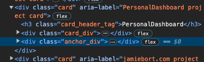

# Design Changes

List of things that need to change with the website.

## Throughout the site.

- The extra html isn't right: https://jamiebort.github.io/html/index.html It should be removed.

- The logo in the tab (see screenshots in the `./DesignChanges/logo_in_the_tab/` directory) does not display on the live site. Only the local site.

- CSS Transitions for

  - navigation menu

  - links

  - buttons

  Search for

      - `css transition property navigation`

      - and for `css transition property buttons`

      - and for `css transition property links`

### Head tag

- Change `<head><title>Jamie Bort</title></head>` so that nothing but my logo shows up in the browser tab, including `Jamie Bort` and `index.html`. Or leave it alone - I like Jamie Bort there.

### Styling/CSS

- The buttons.

  - Their appearance in general.

  - Their appearance when

    - hover
    - focus
    - active
    - etc.

- The mobile `Nav` button. Its appearance when it has been selected and the mobile nave menu is displayed.

- The colors of

  - the links
  - footer
  - header

- The `Jamie Bort` button in the header doesn't bring the page to the top but instead to my `<h1>` tag.

- The two `
` elements are not vertically aligned with the content above and below them. See:

  

### Projects Section

- This one may not be an issue. See the ~~two~~ three screenshots in the `./DesignChanges/display_of_project_cards/` directory. One looks fine while the other ~~does~~ two do not. Specifically, I'd like the two rows of cards have at most a difference of one card between them, not two or more cards.

- Update:

  - Now the last card is left justified. See:

    

  - And the tablet view the cards are single ~~file~~ column. See:

    

- For the projects that have a live site to navigate to, a second button in the footer of the card that says `Live Site` or something like that. See the references to `live site` in the `./js/pinned_projects.js` file.

### Connect with Me Section

- Swap the .png icons for the Font Awesome logos.

- The fifth anchor is left justified in the mobile view. See:

  

  Also, it is a slightly larger card/anchor.

### I am not sure where this belongs

- Make the following changes:

  - `class="card_hearer_tag"` to `class="card_header"`.

  - `class="card_div"` to `class="card_body"`.

  - `class="anchor_div"` to `class="card_footer"`.

- And MAYBE make the following changes:

  - `<h3 class="card_hearer_tag">....</h3>` to `<header class="card_header><h3>....</h3></header>`.

  - `
` to `<main class="card_body">`.

  - `
` to `<footer class="card_footer">`.

  **IF** we can have more than one `<header>`, `<main>`, and `<footer>` in each html file.
  See:

  
